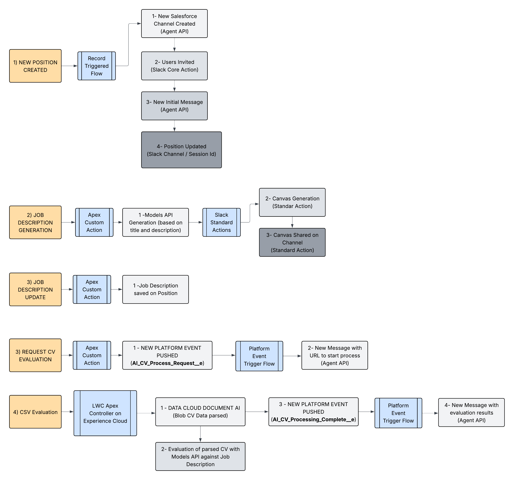

# AI-Powered Recruitment Platform on Salesforce

## 🚀 Overview

This project is an AI-powered recruitment management system built on Salesforce that leverages Einstein AI and Document AI to streamline the hiring process. It automates job description creation, CV analysis, and candidate evaluation, while integrating with Slack for real-time collaboration.

## 🏗️ Architecture



The system architecture demonstrates the flow from user interactions through Salesforce Actions to AI processing and Slack integration. Key components include:
- **Salesforce Actions**: Entry points for user interactions
- **Einstein AI Platform**: Powers intelligent document processing and text generation
- **Document AI**: Extracts structured data from resumes and CVs
- **Event-Driven Architecture**: Uses Platform Events for asynchronous processing
- **Slack Integration**: Enables real-time team collaboration

## 📺 Demo Video

Watch the platform in action: [AI-Powered Recruitment Platform Demo](https://www.youtube.com/watch?v=APl7mnyPVYw)

## 🎯 Key Features

### 1. **AI-Powered Job Description Generation**
- Automatically creates professional job descriptions from basic position details
- Uses Einstein GPT-5 model for context-aware content generation
- Outputs markdown-formatted descriptions ready for posting

### 2. **Intelligent CV Analysis**
- Upload and process PDF resumes through a custom Lightning Web Component
- Extract structured data using Document AI
- Compare candidate profiles against job requirements using AI
- Get instant fit analysis and recommendations

### 3. **Real-time Slack Integration**
- Automatic Slack channel creation for each position
- AI evaluation results posted directly to Slack channels
- Team collaboration on candidate feedback


### 4. **Event-Driven Processing**
- Platform Events for asynchronous AI processing
- Non-blocking user experience
- Scalable architecture for high-volume recruitment

## 🛠️ Technical Stack

### Salesforce Technologies
- **Apex Classes**: Business logic and AI integration
- **Lightning Web Components (LWC)**: Modern UI for CV upload
- **Invocable Methods**: Flow and Action integration
- **Platform Events**: Asynchronous processing
- **Named Credentials**: Secure API connections

### AI & ML
- **Einstein AI Platform (GPT-5)**: Natural language processing
- **Document AI**: Resume parsing and data extraction
- **Prompt Engineering**: Optimized prompts for accurate results

### Development Tools
- **SFDX**: Salesforce development framework
- **Jest**: JavaScript testing framework
- **ESLint**: Code quality enforcement
- **Prettier**: Code formatting
- **Husky**: Git hooks for quality control

## 📁 Project Structure

```
dreamforce-hackathon/
├── force-app/
│   └── main/
│       └── default/
│           ├── classes/
│           │   ├── AgentSlackChannelCreationResponse.cls
│           │   ├── CVAnalyzerController.cls
│           │   ├── GenerateAICVEvaluation.cls
│           │   └── CreateJobDescriptionDraft.cls
│           └── lwc/
│               └── cvUploader/
│                   ├── cvUploader.js
│                   ├── cvUploader.html
│                   └── cvUploader.css
├── config/
│   └── project-scratch-def.json
├── scripts/
│   ├── apex/
│   └── soql/
└── manifest/
    └── package.xml
```

## 🔧 Core Components

### Apex Classes

#### `CVAnalyzerController.cls`
- Handles CV upload and processing
- Integrates with Document AI for data extraction
- Triggers AI evaluation against job requirements
- Publishes results to Platform Events

#### `CreateJobDescriptionDraft.cls`
- Invocable method for Flow integration
- Generates job descriptions using Einstein AI
- Returns structured JSON with title and description

#### `GenerateAICVEvaluation.cls`
- Orchestrates the CV evaluation process
- Publishes events for asynchronous processing
- Integrates with recruitment workflows

#### `AgentSlackChannelCreationResponse.cls`
- Manages Slack channel creation responses
- Stores channel IDs for future communications

### Lightning Web Components

#### `cvUploader`
- Drag-and-drop file upload interface
- Real-time file processing feedback
- Base64 encoding for API transmission
- Progress indicators and error handling

## 📊 Platform Events

The system leverages Salesforce Platform Events for asynchronous processing:
- `AI_CV_Processing_Complete__e`: Signals CV analysis completion
- `AI_CV_Process_Request__e`: Triggers CV evaluation workflow

## 📝 License

This project was created for Dreamforce Hackathon demonstration purposes.

## 🙏 Acknowledgments

- Salesforce Einstein AI team
- Document AI platform
- Dreamforce Hackathon organizers

---

**Built with ❤️ for Dreamforce Hackathon**